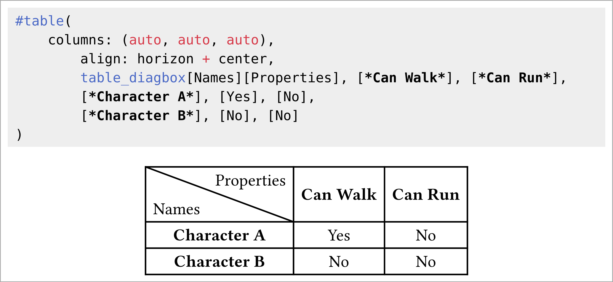

# typst-diagbox
A library for diagonal line dividers in Typst tables and grids; a.k.a., cells with a diagonal line dividing them.

## Usage

Move the `diagbox.typ` file to e.g. the same folder your main `.typ` file is in, then write `#import "diagbox.typ": *` inside it.

This will import two functions:
- `table_diagbox[left][right]`, can be used inside tables.
- `grid_diagbox[left][right]`, can be used inside grids.

See sample usage in the `examples` folder.

## License

Licensed under MIT or Apache-2.0, at your option.
